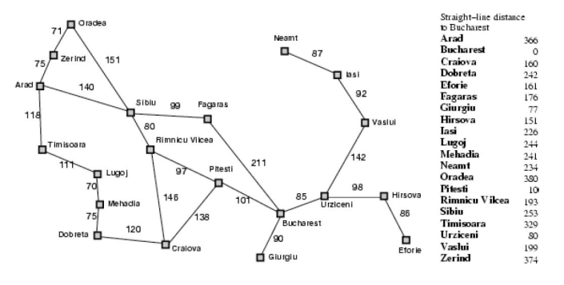

# Búsqueda heurística (informada)

Este código implementa el algoritmo A*, que es un algoritmo de búsqueda informada utilizado en la planificación de rutas y en juegos para encontrar el camino más corto entre dos puntos.

1. Se crean dos nodos, `nodo_inicio` y `nodo_objetivo`, a partir de los parámetros de entrada `inicio` y `objetivo`. El nodo de inicio se inicializa con un costo de camino de 0 y su valor heurístico.

2. Se crean dos listas, `nodos_abiertos` y `nodos_cerrados`. `nodos_abiertos` contiene los nodos que aún no se han explorado pero que se conocen, mientras que `nodos_cerrados` contiene los nodos que ya se han explorado.

3. El bucle `while` se ejecuta mientras haya nodos en `nodos_abiertos`. En cada iteración, se selecciona el nodo con el menor costo total (costo del camino más heurística) y se elimina de `nodos_abiertos`.

4. Si el nodo seleccionado es el nodo objetivo, se ha encontrado un camino. El código entonces rastrea hacia atrás desde el nodo objetivo al nodo de inicio a través de los padres de cada nodo, y devuelve este camino.

5. Si el nodo seleccionado no es el objetivo, se añade a `nodos_cerrados` y se exploran todos sus vecinos. Para cada vecino, si ya está en `nodos_cerrados`, se ignora. De lo contrario, se crea un nuevo nodo para el vecino con el nodo actual como padre y el costo del camino actualizado.

6. Si ya existe un nodo para el vecino en `nodos_abiertos` con un costo de camino menor o igual, se ignora el nuevo nodo. De lo contrario, se añade a `nodos_abiertos`.

7. Si el bucle termina sin encontrar un camino al nodo objetivo, la función devuelve `None`, indicando que no hay camino posible.

## Heurística

Será la distancia de en línea recta desde la ciudad hasta Bucharest.

| Ciudad           | Heurística |
|------------------|------------|
| Arad             | 366        |
| Zerind           | 374        |
| Oradea           | 380        |
| Sibiu            | 253        |
| Fagaras          | 178        |
| Rimnicu Vilcea   | 193        |
| Pitesti          | 98         |
| Craiova          | 160        |
| Drobeta          | 242        |
| Mehadia          | 241        |
| Lugoj            | 244        |
| Timisoara        | 329        |
| Bucarest         | 0          |

## Mapa de conexiones

Este es el mapa de las posibles conexiones entre cada ciudad 

- **Arad:**
  - Zerind: 75
  - Sibiu: 140
  - Timisoara: 118

- **Zerind:**
  - Arad: 75
  - Oradea: 71

- **Oradea:**
  - Zerind: 71
  - Sibiu: 151

- **Sibiu:**
  - Arad: 140
  - Oradea: 151
  - Fagaras: 99
  - Rimnicu Vilcea: 80

- **Fagaras:**
  - Sibiu: 99
  - Bucarest: 211

- **Rimnicu Vilcea:**
  - Sibiu: 80
  - Pitesti: 97
  - Craiova: 146

- **Pitesti:**
  - Rimnicu Vilcea: 97
  - Bucarest: 101
  - Craiova: 138

- **Craiova:**
  - Rimnicu Vilcea: 146
  - Pitesti: 138
  - Drobeta: 120

- **Drobeta:**
  - Craiova: 120
  - Mehadia: 75

- **Mehadia:**
  - Drobeta: 75
  - Lugoj: 70

- **Lugoj:**
  - Mehadia: 70
  - Timisoara: 111

- **Timisoara:**
  - Arad: 118
  - Lugoj: 111

- **Bucarest:**
  - Fagaras: 211
  - Pitesti: 101
